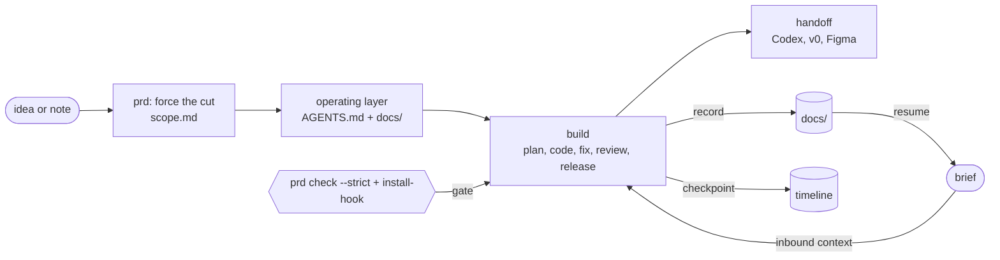

# AI PM Dev Agent

[README en chino](README.zh-CN.md)

AI PM Dev Agent no es una plataforma de agentes de propósito general, y no es un reemplazo para Dify / Coze. Es una **CLI de flujo de trabajo de Idea-a-Construcción local** para el desarrollo de productos asistido por IA: un núcleo de flujo de trabajo ligero que convierte ideas preliminares y chats de codificación con IA de un solo uso en contexto de proyecto reutilizable, alcance, controles y traspasos.

Convierte una idea de producto preliminar en un PRD estructurado **y en un proyecto en el que las herramientas de codificación con IA aguas abajo (Claude Code, Codex, v0, Figma) ya saben cómo trabajar** — sin escribir un prompt a mano.

**El ciclo que instala** — contexto entrante, un PRD forzado, una capa de operación, construcción, registro, un control y traspaso saliente:



`ai-pm-dev` es una CLI local. Realiza dos cosas:

1. **Te entrevista** sobre una idea de producto y genera un PRD de IA, un resumen del prototipo y traspasos específicos para herramientas.
2. **Instala una capa de operación del proyecto** — un archivo de entrada `AGENTS.md` más un conjunto `docs/` (resumen del proyecto, especificación de UI, pruebas de aceptación, registro de decisiones, preguntas abiertas, …) que cualquier herramienta de IA lee al abrir la carpeta, para que conozca el protocolo antes/después de la tarea, el límite del MVP y qué documentos actualizar.

Resuelve los problemas que surgen en el desarrollo real asistido por IA: contexto reconstruido en cada sesión, alcance vago, criterios de aceptación faltantes, notas de traspaso dispersas y herramientas de IA que saltan al código antes de que se tome la decisión de producto. No **llama** a una API de LLM, ejecuta Dify/Coze ni ejecuta agentes por sí misma. Esas herramientas pueden ubicarse fuera de ella más tarde como capas de UI o automatización; `ai-pm-dev` mantiene el núcleo del flujo de trabajo local, los archivos de contexto y los controles.

## Cómo asiste al desarrollo

No escribe el código por ti. Codifica una **división del trabajo** entre tú y las herramientas de codificación con IA que ya usas (Codex, Claude Code, v0), y mantiene a ambas partes honestas para que la colaboración siga siendo rastreable y resistente a la deriva y la alucinación.

**Tú tienes el criterio.** Límites de requisitos, qué recortar, prioridades, decisiones de datos y permisos, límites de riesgo. La herramienta *fuerza* esto en lugar de dejarlo vago: la entrevista de PM limita los requisitos esenciales a 3, exige un objetivo no deseado (non-goal) y una única métrica, y escribe un `scope.md`; `prd check --strict` falla hasta que se complete el recorte.

**La IA realiza la ejecución.** Andamios (scaffolding), CRUD, conexiones, borradores, pruebas. Funciona a partir del `AGENTS.md` + `docs/` del proyecto, por lo que no tienes que volver a explicar el contexto en cada sesión — algo que usualmente hace que la programación en dúo con IA parezca empezar de cero cada vez.

**La herramienta lo mantiene rastreable y resistente a alucinaciones:**

| Riesgo en el desarrollo asistido por IA | Qué hace esta herramienta |
| --- | --- |
| Contexto reconstruido en cada chat | La capa de operación (`AGENTS.md` + `docs/`) es una única fuente de verdad que la IA lee al abrir |
| La IA salta directamente al código | El protocolo PM-challenge fuerza clasificar → recortar → una sola cosa → objetivo no deseado → métrica primero |
| Alcance / prioridades nunca fijados | `scope.md` + control `prd check --strict` (salida no cero, controlable en CI/commit) |
| "¿Por qué decidimos X?" perdido en el chat | `decide` / `pitfall` / `note` de una línea se agregan a `decision-log.md` / `troubleshooting.md` |
| La IA construye algo fuera de especificación | `code-review` realiza una **conciliación de intención vs. implementación**: ¿el código entregó realmente `acceptance-tests.md` y `scope.md`, o se coló un objetivo no deseado? |
| Los documentos se desvían de la realidad | `doctor` marca los documentos que aún son plantillas vacías |

**El ciclo:** idea → PRD forzado (recortar alcance, definir métrica) → instalar capa de operación → la IA aguas abajo construye leyendo `AGENTS.md` → registras decisiones/obstáculos a medida que avanzas → la revisión verifica el código contra el PRD. Es un *flujo de trabajo flexible* alrededor de un modelo capaz, no un sistema multi-agente — el valor es un proceso estable y verificable, no la cantidad de agentes.

## Ve cómo funciona

[`examples/quick-date/`](examples/quick-date/) es una ejecución completa de extremo a extremo sobre una idea real: idea → entrevista → PRD de IA → documentos del proyecto → traspasos a Codex/v0 → informe de calidad → una [retrospectiva](examples/quick-date/retrospective.md) de lo que el flujo de trabajo capturó.

## Requisitos

- Node.js 18 o posterior (`node -v`)

## Instalación

```bash
npm install -g github:Andrew-JX/ai-pm-dev
```

Pruébalo sin instalarlo globalmente:

```bash
npx github:Andrew-JX/ai-pm-dev --help
```

## Inicio rápido (60 segundos)

```bash
mkdir my-product && cd my-product
ai-pm-dev init .          # instala la capa de operación en esta carpeta
ai-pm-dev prd             # responde la entrevista de PM (usa --lang zh para chino)
ai-pm-dev prd check       # puntúa el PRD; escribe quality-report.md
ai-pm-dev doctor          # confirma que todo está en su lugar
ai-pm-dev dashboard       # escribe un panel de estado de solo lectura del proyecto
```

## Entorno de trabajo web Fase 1

Este repositorio ahora incluye el primer entorno de trabajo productivo para el núcleo del flujo de trabajo local. No reemplaza a la CLI; visualiza la misma capa de operación del proyecto y usa la CLI para acciones ligeras.

```bash
npm install
npm run web --workspace apps/web
npm run web:build --workspace apps/web
```

El entorno de trabajo lee un proyecto objetivo existente y muestra el ciclo de vida del producto, la fase actual, el control del PRD, el alcance del MVP, tarjetas de artefactos, preguntas abiertas, decisiones, progreso y la siguiente acción recomendada. También puede generar PRD rápidos, `prd check`, puntos de control y decisiones de una línea a través de la CLI `ai-pm-dev` existente.

La Fase 1 intencionalmente no incluye React Flow, un entorno de ejecución de agentes, generación automática de demos/código ni llamadas a API de LLM.

## Luego pásalo a una herramienta de codificación: dos formas

**A. Abrir la carpeta (recomendado).** Abre `my-product` en Claude Code o Codex. Leen `AGENTS.md` automáticamente, lo que los dirige a `docs/PROJECT_BRIEF.md` y el resto. Simplemente puedes decir:

> Continúa con el flujo de trabajo AI PM Dev de este proyecto.

Para alimentar una sesión nueva con su contexto de una vez (el lado entrante del traspaso), ejecuta `ai-pm-dev brief` y pega el resumen — línea principal, requisitos esenciales, preguntas abiertas, decisiones recientes, progreso, obstáculos y siguiente paso.

**B. Pegar un prompt de traspaso.** Si tu herramienta no lee automáticamente los archivos del proyecto, copia un prompt específico para la herramienta:

```bash
ai-pm-dev prd handoff --to codex
ai-pm-dev prd handoff --to v0
ai-pm-dev prd handoff --to figma
```

## Qué instala `init`

```text
my-product/
  AGENTS.md          # archivo de entrada: protocolo antes/después de tarea, manifiesto de docs, enrutamiento
  CLAUDE.md          # puntero ligero a AGENTS.md
  docs/
    PROJECT_BRIEF.md  UI_SPEC.md  acceptance-tests.md
    decision-log.md   open-questions.md  progress.md  troubleshooting.md
  skills/            # 9 habilidades de rol (spec, design, plan, build, bug-fix, review, release, prd)
  templates/         # plantillas de artefactos reutilizables
  memory/            # registro de feedback, candidatos a reglas, registro de mejora de habilidades
```

Luego, `prd` llena `PROJECT_BRIEF.md`, `UI_SPEC.md` y `acceptance-tests.md`, agrega a `decision-log.md`, registra cualquier respuesta en blanco en `open-questions.md` y escribe `follow-up-questions.md` para el siguiente paso de PM. Los archivos existentes que has editado se conservan — solo se sembran las plantillas vacías. Si `CLAUDE.md`/`AGENTS.md` ya existen, se respaldan como `*.ai-pm-dev-backup.md`.

## Opciones de PRD

```bash
ai-pm-dev prd --lang zh                 # entrevista en chino (predeterminado: en, o pregunta)
ai-pm-dev prd --type consumer           # omite preguntas solo para IA en un producto no-AI
ai-pm-dev prd --type ai-tool|saas|consumer|internal-tool
ai-pm-dev prd --from-note idea.md       # semilla la idea desde una nota/registro de chat, omitir reescribirla
ai-pm-dev prd --quick                   # captura solo quién/qué/por qué; deja que tu IA maneje el interrogatorio
```

`--quick` pregunta solo la idea, los usuarios y el problema, y luego hace el traspaso: abre el proyecto en tu herramienta de IA y ejecuta el desafío PM (clasificar → recortar a 3 → la única cosa → un objetivo no deseado → una métrica). Los elementos sin respuesta se registran en `docs/open-questions.md`, y la sesión obtiene un `follow-up-questions.md` local con preguntas adaptativas para las lagunas más importantes.

Con `--from-note`, la primera línea del archivo se convierte en la idea, el resto se guarda como `source-note.md` en la sesión, y las preguntas restantes aún se hacen. Las respuestas escasas del paso basado en notas también producen seguimientos adaptativos; no se llama a una API de LLM.

`prd check` informa `PASS/WARN/FAIL`. Verifica las respuestas estructuradas del PRD y también comprueba que `docs/scope.md`, `docs/acceptance-tests.md` y los traspasos de Codex/v0/Figma aún hagan referencia a los últimos controles del PRD. Para un producto sin IA, las lagunas específicas de IA son **WARN ("marcar como no aplicable")**, no FAIL.

### Fuerza las decisiones difíciles de PM

La entrevista se construye alrededor de recortar y priorizar (los prompts lo piden; el formulario no insiste — el rigor vive en el control de abajo y en el protocolo PM-challenge de la IA aguas abajo):

- **Los requisitos esenciales están limitados a 3.** Cualquier cosa que supere el límite se registra como diferida en `scope.md`.
- **Objetivos no deseados** — nombra algo que deliberadamente *no* vas a hacer.
- **La única cosa** — la única característica que prueba la idea si pudieras lanzar una.
- **Una única métrica de éxito medible.**

Cada sesión escribe un `scope.md` (requisitos esenciales / la única cosa / objetivos no deseados / lista de recortes / métrica). Y `prd check --strict` **sale con código no cero** cuando faltan estos, por lo que puedes controlar un commit o ejecución de CI con él:

```bash
ai-pm-dev prd check --strict   # salida 1 si el alcance/priorización no está completo
```

`--strict` también falla si los documentos del proyecto se desvían del último PRD: `scope.md` debe contener los requisitos esenciales actuales / la única cosa / objetivos no deseados / métrica, `acceptance-tests.md` debe cubrir el flujo de trabajo central actual y la señal de éxito, y cada traspaso debe dirigir a las herramientas aguas abajo a `ai-prd.md`, `scope.md` y `acceptance-tests.md`.

## Mantén los documentos actualizados (una línea cada uno)

Actualizar un documento no debería significar abrir un archivo. A medida que construyas, registra decisiones y obstáculos en línea — estos se agregan a `docs/` y `doctor` deja de marcarlos como vacíos:

```bash
ai-pm-dev decide "Lanzar solo web para v1" --why "camino más rápido a un demo utilizable"
ai-pm-dev decision-record "Agregar facturación" --why "cambio mayor con riesgo de reversión" --non-goals "Sin migración de planes en v1"
ai-pm-dev bug "Enviar devuelve 500" --actual "HTTP 500 después de guardar" --expected "Confirmación de guardado" --repro "1. Abrir envío 2. Llenar formulario 3. Guardar" --impact "Bloquea flujo principal" --verify "npm test + envío manual"
ai-pm-dev pitfall "La animación se pausa cuando la pestaña está oculta" --fix "reanudar en visibilitychange"
ai-pm-dev note "completé el flujo exitoso de extremo a extremo"
```

`ai-pm-dev doctor` lista cualquier documento central que aún sea una plantilla vacía, por lo que la deriva es visible. Usa `decision-record` antes de cambios mayores: escribe un registro tipo KEP-lite bajo `docs/decision-records/` con objetivos, objetivos no deseados, plan de pruebas, plan de reversión, verificaciones de preparación y un enlace de vuelta a `docs/decision-log.md`. Usa `bug` antes de corregir un defecto: se niega a escribir un informe a menos que se proporcionen el comportamiento actual, el comportamiento esperado, los pasos de reproducción, el impacto y la verificación.

Para un control estricto (opt-in), instala un gancho pre-commit de git que **bloquee un commit cuando el código cambió pero `docs/` no se actualizó** — así el registro no puede omitirse, ni siquiera por la IA:

```bash
ai-pm-dev install-pr-template # agrega .github/PULL_REQUEST_TEMPLATE.md con verificaciones de PRD/alcance/pruebas
ai-pm-dev install-ownership   # agrega docs/ownership.md + .ai-pm-dev/owners.json enrutamiento de revisión
ai-pm-dev review-route --paths "docs/scope.md,bin/ai-pm-dev.mjs"
ai-pm-dev workflow check --strict # falla si las habilidades de desarrollo pierden guardarriles
ai-pm-dev install-hook       # bloquea commits solo de código; registra en docs/ primero
ai-pm-dev uninstall-hook     # lo elimina
# omitir un commit individual a propósito: git commit --no-verify
```

El control de la plantilla de PR pide que cada PR nombre la sesión del PRD, el requisito esencial mapeado, el límite de objetivos no deseados, actualizaciones de documentos, evidencia de pruebas, nota de lanzamiento y notas adicionales para revisores. Las plantillas de PR personalizadas existentes se conservan a menos que pases `--force`.
La ruta de propiedad es un mapa local estilo OWNERS: las rutas cambiadas apuntan al lente de habilidad correcto, documentos a leer y verificaciones a ejecutar antes de la revisión.
La verificación del flujo de trabajo hace lint a las habilidades del lado del desarrollo para cinco guardarriles no negociables: contexto, verificación, límite de riesgo, actualización de documentos y reversión. `ai-pm-dev skill lint` es un alias para la misma verificación cuando trabajas directamente en archivos de habilidades.

Si estás construyendo para aprender, dos más se agregan a `docs/keywords.md` y `docs/learning-log.md` (creados bajo demanda, para que no ensucien un proyecto normal):

```bash
ai-pm-dev keyword "AOP" --explain "insertar lógica alrededor de métodos sin tocar código de negocio"
ai-pm-dev learned "login: controlador valida -> servicio emite token -> cliente lo almacena"
```

El `AGENTS.md` incluido también le dice a las herramientas aguas abajo que expliquen la cadena principal de solicitudes y que nunca borren tus propios comentarios/notas — así el objetivo es una característica que realmente puedas explicar.

## Comandos

```bash
ai-pm-dev init <target>
ai-pm-dev prd [--target <target>] [--lang <zh|en>] [--type <...>] [--from-note <file>]
ai-pm-dev prd status [--target <target>]
ai-pm-dev prd check [--target <target>]
ai-pm-dev prd handoff --to <codex|v0|figma> [--target <target>]
ai-pm-dev dashboard [--target <target>]
ai-pm-dev start "<task>" --type <type> --target <target> --save
ai-pm-dev decide "<decision>" [--why <reason>] [--target <target>]
ai-pm-dev decision-record "<title>" [--why <reason>] [--goals <goals>] [--non-goals <non-goals>] [--test <plan>] [--rollback <plan>] [--target <target>]
ai-pm-dev bug "<title>" --actual <text> --expected <text> --repro <steps> --impact <scope> --verify <plan> [--env <info>] [--target <target>]
ai-pm-dev note "<progress note>" [--target <target>]
ai-pm-dev pitfall "<symptom>" [--cause <c>] [--fix <f>] [--target <target>]
ai-pm-dev install-ownership [--target <target>] [--force]
ai-pm-dev review-route [--target <target>] [--paths <path1,path2>]
ai-pm-dev workflow check [--target <target>] [--strict]
ai-pm-dev skill lint [--target <target>] [--strict]
ai-pm-dev install-pr-template [--target <target>] [--force]
ai-pm-dev status  [--target <target>]
ai-pm-dev doctor  [--target <target>]
ai-pm-dev config  set target <target> | get | clear
ai-pm-dev onboarding
ai-pm-dev release-check
```

## Enrutar una tarea de codificación (sin un PRD completo)

`start` enruta una tarea de implementación a una Habilidad y genera un prompt:

```bash
ai-pm-dev start "La página de envío devuelve 500" --type bug --save
```

Tipos `--type` soportados: `spec`, `brief`, `design`, `plan`, `build`, `bug`, `review`, `release`.

## Windows / PowerShell

Los archivos de la CLI son UTF-8. Si la salida en chino aparece corrupta en el terminal, cambia la consola a UTF-8 (`chcp 65001`, o `$OutputEncoding = [Text.Encoding]::UTF8`). Los archivos en sí están bien — es solo una configuración de visualización de la consola.

## Límite actual

Un núcleo de flujo de trabajo local, no una plataforma de agentes general: sin llamadas a API de LLM, sin automatización Axure/Dify/Coze, sin ejecución multi-agente autónoma. Produce activos de PM estructurados, una capa de operación del proyecto y controles de calidad para que las herramientas de IA aguas abajo trabajen con un contexto más claro.
