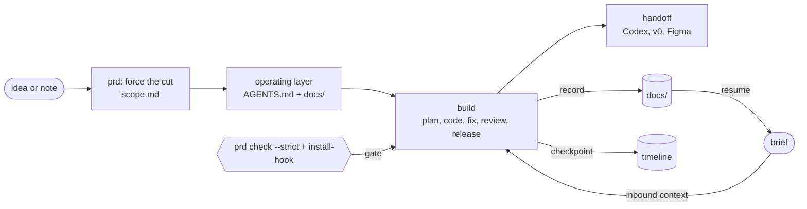

# AI PM Dev Agent

[中文 README](README.zh-CN.md)

AI PM Dev Agent is not a general-purpose agent platform, and it is not a
Dify / Coze replacement. It is a local **Idea-to-Build workflow CLI** for
AI-assisted product development: a lightweight workflow kernel that turns rough
ideas and one-off AI coding chats into reusable project context, scope, gates,
and handoffs.

Turn a rough product idea into a structured PRD **and a project that downstream AI coding
tools (Claude Code, Codex, v0, Figma) already know how to work in** — without writing a
prompt by hand.

**The loop it installs** — inbound context, a forced PRD, an operating layer, build, recording, a gate, and outbound handoff:



`ai-pm-dev` is a local CLI. It does two things:

1. **Interviews you** about a product idea and generates an AI-PRD, prototype brief, and
   tool-specific handoffs.
2. **Installs a project operating layer** — an `AGENTS.md` entry file plus a `docs/` set
   (project brief, UI spec, acceptance tests, decision log, open questions, …) that any AI
   tool reads when it opens the folder, so it knows the before/after-task protocol, the MVP
   boundary, and which docs to update.

It solves the problems that show up in real AI-assisted development: context rebuilt every
session, vague scope, missing acceptance criteria, scattered handoff notes, and AI tools
jumping to code before the product decision has been made. It does **not** call an LLM API,
run Dify/Coze, or execute agents itself. Those tools can sit outside it later as UI or
automation layers; `ai-pm-dev` keeps the local workflow kernel, context files, and gates.

## How it assists development

It does not write the code for you. It encodes a **division of labor** between you and the
AI coding tools you already use (Codex, Claude Code, v0), and keeps both sides honest so the
collaboration stays traceable and resistant to drift and hallucination.

**You own the judgment.** Requirement boundaries, what to cut, priorities, data and
permission decisions, risk limits. The tool *forces* these instead of letting them stay
vague: the PM interview caps must-haves at 3, requires a non-goal and a single metric, and
writes a `scope.md`; `prd check --strict` fails until the cutting is done.

**The AI does the execution.** Scaffolding, CRUD, wiring, drafts, tests. It works from the
project's `AGENTS.md` + `docs/`, so you don't re-explain context every session — the thing
that usually makes AI pair-programming feel like starting over each time.

**The tool keeps it traceable and hallucination-resistant:**

| Risk in AI-assisted dev | What this tool does |
| --- | --- |
| Context rebuilt every chat | Operating layer (`AGENTS.md` + `docs/`) is a single source of truth the AI reads on open |
| AI jumps straight to code | PM-challenge protocol forces rank → cut → one thing → non-goal → metric first |
| Scope / priorities never pinned | `scope.md` + `prd check --strict` gate (exit non-zero, gateable in CI/commit) |
| "Why did we decide X?" lost in chat | One-line `decide` / `pitfall` / `note` append to `decision-log.md` / `troubleshooting.md` |
| AI builds something off-spec | `code-review` does an **intent-vs-implementation reconciliation**: did the code actually deliver `acceptance-tests.md` and `scope.md`, or sneak in a non-goal |
| Docs drift from reality | `doctor` flags docs that are still empty stubs |

**The loop:** idea → forced PRD (cut scope, set the metric) → install operating layer → the
downstream AI builds by reading `AGENTS.md` → you log decisions/pitfalls as you go → review
checks the code against the PRD. It is a *soft workflow* around one capable model, not a
multi-agent system — the value is a stable, verifiable process, not agent count.

## See it work

[`examples/quick-date/`](examples/quick-date/) is a full end-to-end run on one real idea:
idea → interview → AI-PRD → project docs → Codex/v0 handoffs → quality report → a
[retrospective](examples/quick-date/retrospective.md) of what the workflow caught.

## Requirements

- Node.js 18 or newer (`node -v`)

## Install

```bash
npm install -g github:Andrew-JX/ai-pm-dev
```

Try it without installing globally:

```bash
npx github:Andrew-JX/ai-pm-dev --help
```

## Quickstart (60 seconds)

```bash
mkdir my-product && cd my-product
ai-pm-dev init .          # install the operating layer into this folder
ai-pm-dev prd             # answer the PM interview (use --lang zh for Chinese)
ai-pm-dev prd check       # score the PRD; writes quality-report.md
ai-pm-dev doctor          # confirm everything is in place
ai-pm-dev dashboard       # write a read-only project status dashboard
```

## Phase 1 Web Workbench

This repo now includes the first productized workbench for the local workflow kernel. It
does not replace the CLI; it visualizes the same project operating layer and uses the CLI
for lightweight actions.

```bash
npm install
npm run web --workspace apps/web
npm run web:build --workspace apps/web
```

The workbench reads an existing target project and shows the product lifecycle, current
phase, PRD gate, MVP scope, artifact cards, open questions, decisions, progress, and next
recommended action. It can also trigger quick PRD generation, `prd check`, checkpoints, and
one-line decisions through the existing `ai-pm-dev` CLI.

Phase 1 intentionally does not include React Flow, an agent runtime, automatic demo/code
generation, or LLM API calls.

## Then hand it to a coding tool — two ways

**A. Open the folder (recommended).** Open `my-product` in Claude Code or Codex. They read
`AGENTS.md` automatically, which points them to `docs/PROJECT_BRIEF.md` and the rest. You can
just say:

> Continue with this project's AI PM Dev workflow.

To feed a fresh session its context in one shot (the inbound side of handoff), run
`ai-pm-dev brief` and paste the digest — one-liner, must-haves, open questions, recent
decisions, progress, pitfalls, and next step.

**B. Paste a handoff prompt.** If your tool does not auto-read project files, copy a
tool-specific prompt:

```bash
ai-pm-dev prd handoff --to codex
ai-pm-dev prd handoff --to v0
ai-pm-dev prd handoff --to figma
```

## What `init` installs

```text
my-product/
  AGENTS.md          # entry file: before/after-task protocol, docs manifest, routing
  CLAUDE.md          # thin pointer to AGENTS.md
  docs/
    PROJECT_BRIEF.md  UI_SPEC.md  acceptance-tests.md
    decision-log.md   open-questions.md  progress.md  troubleshooting.md
  skills/            # 9 role skills (spec, design, plan, build, bug-fix, review, release, prd)
  templates/         # reusable artifact templates
  memory/            # feedback log, rule candidates, skill-improvement log
```

`prd` then fills `PROJECT_BRIEF.md`, `UI_SPEC.md`, and `acceptance-tests.md`, appends to
`decision-log.md`, records any blank answers in `open-questions.md`, and writes
`follow-up-questions.md` for the next PM pass. Existing files you
have edited are preserved — only unfilled stubs are seeded. If `CLAUDE.md`/`AGENTS.md`
already exist they are backed up as `*.ai-pm-dev-backup.md`.

## PRD options

```bash
ai-pm-dev prd --lang zh                 # interview in Chinese (default: en, or asks)
ai-pm-dev prd --type consumer           # skip AI-only questions for a non-AI product
ai-pm-dev prd --type ai-tool|saas|consumer|internal-tool
ai-pm-dev prd --from-note idea.md       # seed the idea from a note/chat log, skip retyping it
ai-pm-dev prd --quick                   # capture only who/what/why; let your AI run the interrogation
```

`--quick` asks just the idea, users, and pain, then hands off: open the project in your AI
tool and it runs the PM challenge (rank → cut to 3 → the one thing → a non-goal → one metric).
The unanswered items are recorded in `docs/open-questions.md`, and the session gets a
local `follow-up-questions.md` with adaptive questions for the gaps that matter most.

With `--from-note`, the first line of the file becomes the idea, the rest is saved as
`source-note.md` in the session, and the remaining questions are still asked. Sparse
answers from the note-driven pass also produce adaptive follow-ups; no LLM API is called.

`prd check` reports `PASS/WARN/FAIL`. It checks the structured PRD answers and also verifies
that `docs/scope.md`, `docs/acceptance-tests.md`, and the Codex/v0/Figma handoffs still
reference the latest PRD gates. For a product with no AI, AI-specific gaps are **WARN
("mark not-applicable")**, not FAIL.

### It forces the hard PM calls

The interview is built around cutting and prioritizing (the prompts ask for it; the form
does not nag — rigor lives in the gate below and in the downstream AI's PM-challenge protocol):

- **Must-haves are capped at 3.** Anything over the line is recorded as deferred in `scope.md`.
- **Non-goals** — name something you are deliberately *not* doing.
- **The one thing** — the single feature that proves the idea if you could ship one.
- **A single measurable success metric.**

Each session writes a `scope.md` (must-haves / the one thing / non-goals / cut list / metric).
And `prd check --strict` **exits non-zero** when these are missing, so you can gate a commit
or CI run on it:

```bash
ai-pm-dev prd check --strict   # exit 1 if scope/prioritization is not done
```

`--strict` also fails if the project docs drift away from the latest PRD: `scope.md` must
carry the current must-haves / one thing / non-goals / metric, `acceptance-tests.md` must
cover the current core workflow and success signal, and every handoff must point downstream
tools to `ai-prd.md`, `scope.md`, and `acceptance-tests.md`.

## Keep docs current (one line each)

Updating a doc should not mean opening a file. As you build, log decisions and pitfalls
inline — these append to `docs/` and `doctor` stops flagging them as empty:

```bash
ai-pm-dev decide "Ship web-only for v1" --why "fastest path to a usable demo"
ai-pm-dev decision-record "Add billing" --why "larger change with rollback risk" --non-goals "No plan migration in v1"
ai-pm-dev bug "Submit returns 500" --actual "HTTP 500 after save" --expected "Saved confirmation" --repro "1. Open submit 2. Fill form 3. Save" --impact "Blocks core flow" --verify "npm test + manual submit"
ai-pm-dev pitfall "Animation pauses when the tab is hidden" --fix "resume on visibilitychange"
ai-pm-dev note "finished the end-to-end happy path"
```

`ai-pm-dev doctor` lists any core docs that are still empty stubs, so drift is visible.
Use `decision-record` before larger changes: it writes a KEP-lite record under
`docs/decision-records/` with goals, non-goals, test plan, rollback plan, readiness checks,
and a link back into `docs/decision-log.md`.
Use `bug` before fixing a defect: it refuses to write a report unless actual behavior,
expected behavior, reproduction steps, impact, and verification are all provided.

For a hard gate (opt-in), install a git pre-commit hook that **blocks a commit when code
changed but `docs/` was not updated** — so the recording cannot be skipped, not even by the AI:

```bash
ai-pm-dev install-pr-template # add .github/PULL_REQUEST_TEMPLATE.md with PRD/scope/test checks
ai-pm-dev install-ownership   # add docs/ownership.md + .ai-pm-dev/owners.json review routing
ai-pm-dev review-route --paths "docs/scope.md,bin/ai-pm-dev.mjs"
ai-pm-dev workflow check --strict # fail if core development skills lose guardrails
ai-pm-dev install-hook       # block code-only commits; record into docs/ first
ai-pm-dev uninstall-hook     # remove it
# bypass a single commit on purpose: git commit --no-verify
```

The PR template gate asks every PR to name the PRD session, mapped must-have, non-goal
boundary, docs updates, test evidence, release note, and extra reviewer notes. Existing
custom PR templates are preserved unless you pass `--force`.
The ownership route is a local OWNERS-style map: changed paths point to the right skill
lens, docs to read, and checks to run before review.
The workflow check lints the development-side skills for five non-negotiable guardrails:
context, verification, risk boundary, docs update, and rollback. `ai-pm-dev skill lint`
is an alias for the same check when you are working directly on skill files.

If you are building to learn, two more append into `docs/keywords.md` and
`docs/learning-log.md` (created on demand, so they don't clutter a normal project):

```bash
ai-pm-dev keyword "AOP" --explain "insert logic around methods without touching business code"
ai-pm-dev learned "login: controller validates -> service issues token -> client stores it"
```

The shipped `AGENTS.md` also tells downstream tools to explain the main request chain and to
never delete your own comments/notes — so the goal is a feature you can actually explain.

## Commands

```bash
ai-pm-dev init <target>
ai-pm-dev prd [--target <target>] [--lang <zh|en>] [--type <...>] [--from-note <file>]
ai-pm-dev prd status [--target <target>]
ai-pm-dev prd check [--target <target>]
ai-pm-dev prd handoff --to <codex|v0|figma> [--target <target>]
ai-pm-dev dashboard [--target <target>]
ai-pm-dev start "<task>" --type <type> --target <target> --save
ai-pm-dev decide "<decision>" [--why <reason>] [--target <target>]
ai-pm-dev decision-record "<title>" [--why <reason>] [--goals <goals>] [--non-goals <non-goals>] [--test <plan>] [--rollback <plan>] [--target <target>]
ai-pm-dev bug "<title>" --actual <text> --expected <text> --repro <steps> --impact <scope> --verify <plan> [--env <info>] [--target <target>]
ai-pm-dev note "<progress note>" [--target <target>]
ai-pm-dev pitfall "<symptom>" [--cause <c>] [--fix <f>] [--target <target>]
ai-pm-dev install-ownership [--target <target>] [--force]
ai-pm-dev review-route [--target <target>] [--paths <path1,path2>]
ai-pm-dev workflow check [--target <target>] [--strict]
ai-pm-dev skill lint [--target <target>] [--strict]
ai-pm-dev install-pr-template [--target <target>] [--force]
ai-pm-dev status  [--target <target>]
ai-pm-dev doctor  [--target <target>]
ai-pm-dev config  set target <target> | get | clear
ai-pm-dev onboarding
ai-pm-dev release-check
```

## Routing a coding task (without a full PRD)

`start` routes an implementation task to a Skill and generates a prompt:

```bash
ai-pm-dev start "The submit page returns 500" --type bug --save
```

Supported `--type`: `spec`, `brief`, `design`, `plan`, `build`, `bug`, `review`, `release`.

## Windows / PowerShell

The CLI files are UTF-8. If Chinese output looks garbled in the terminal, switch the console
to UTF-8 (`chcp 65001`, or `$OutputEncoding = [Text.Encoding]::UTF8`). The files themselves
are fine — it is only a console display setting.

## Current boundary

A local workflow kernel, not a general agent platform: no LLM API calls, no Axure/Dify/Coze
automation, no self-running multi-agent execution. It produces structured PM assets, a
project operating layer, and quality gates so downstream AI tools work with clearer context.
